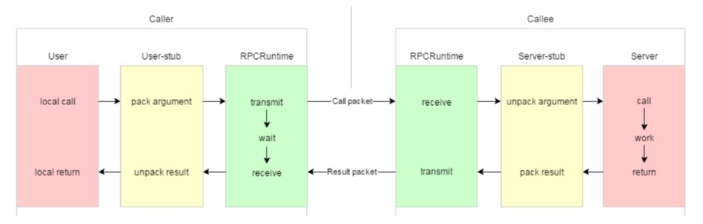

### 分布式网络通信框架
### PRC commitcation

> 黄色部分:设计rpc方法参数的打包和解析，也就是数据的序列化和反序列化，使用Protobuf。
> 绿色部分:网络部分，包括寻找rpc服务主机，发起rpc调用请求和响应rpc调用结果，使用muduo网络
库和zookeeper服务配置中心（专门做服务发现）。

- Protobuf数据序列化和反序列化协议
- ZooKeeper分布式一致性协调服务应用以及编程
- muduo网络库编程
- conf配置文件读取
- 异步日志,其中一个单线程负责IO
- CMake构建项目集成编译环境
